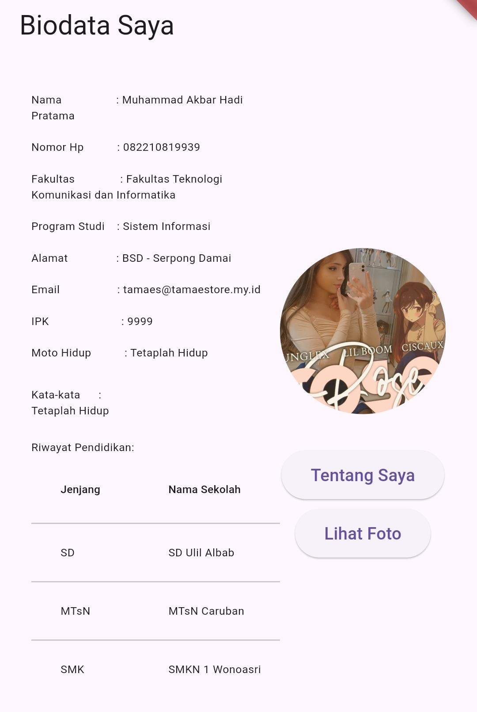
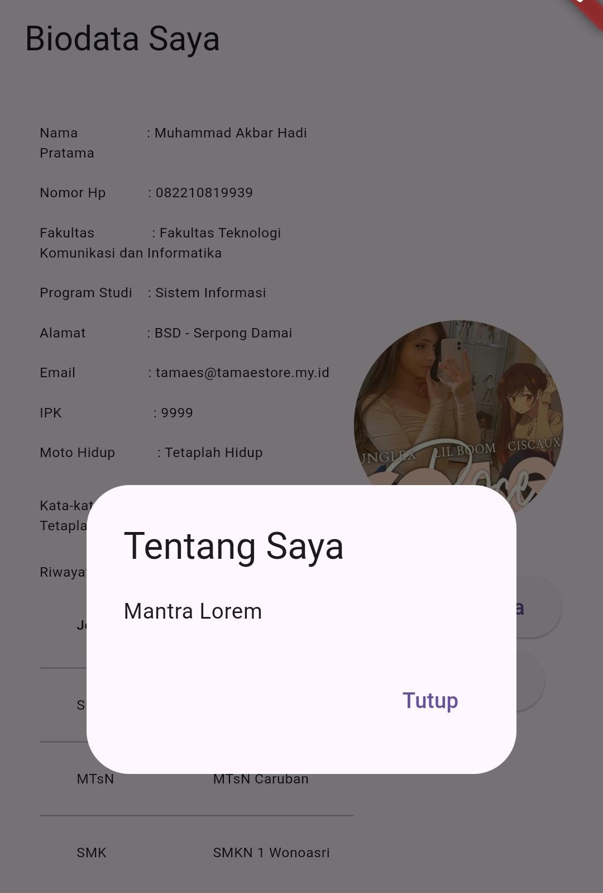
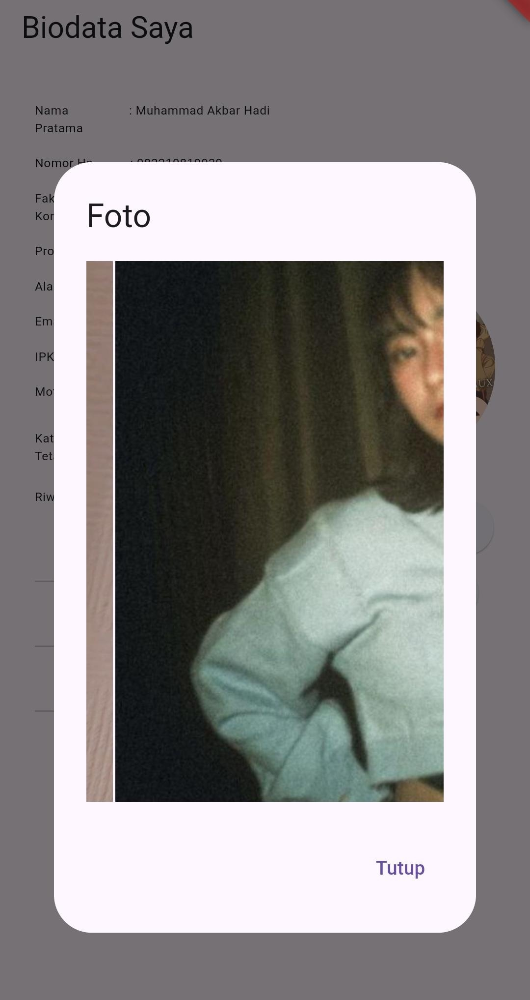

# Biodata App

## Overview
Jadi ini tugas uts saya dari prodi sistem informasi semester 2
--> Aplikasi Flutter ini menampilkan informasi biodata pribadi dengan tambahan sedikit style tambahan biar rapih. Aplikasi ini dirancang untuk berjalan dalam orientasi potret saja dan mencakup fitur interaktif seperti dialog pop-up untuk informasi tambahan dan foto.


## Screenshots
Berikut beberapa potret hasil jadinya di Android:

| Screenshot           | Description              |
|----------------------|--------------------------|
|  | Home |
|  | "About Me" pop-up   |
|  | Photo gallery pop-up |

## Installation

1. **Clone the repository:**
    ```sh
    git clone https://github.com/dasaraul/tugas-uts.git
    cd tugas-uts
    ```

2. **Install dependencies:**
    ```sh
    flutter pub get
    ```

3. **Run the application:**
    ```sh
    flutter run
    ```

## If Error
    ```sh
    gradle clean
    gradle build
    ```

    then

    ```sh
    flutter clean
    flutter run
    ```
